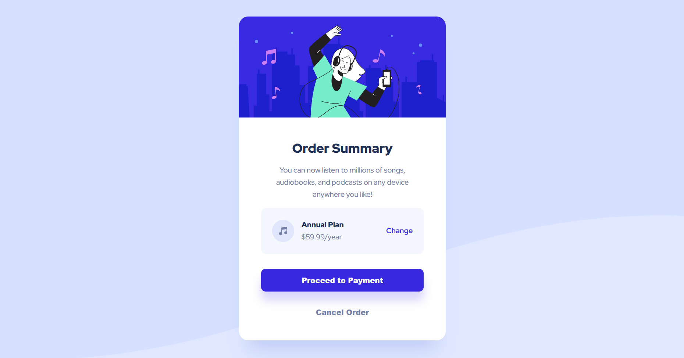

# Frontend Mentor - Order summary card solution

This is a solution to the [Order summary card challenge on Frontend Mentor](https://www.frontendmentor.io/challenges/order-summary-component-QlPmajDUj). Frontend Mentor challenges help you improve your coding skills by building realistic projects.

## Table of contents

- [Overview](#overview)
  - [The challenge](#the-challenge)
  - [Screenshot](#screenshot)
  - [Links](#links)
- [My process](#my-process)
  - [Built with](#built-with)
  - [What I learned & Key Challenges](#what-i-learned--key-challenges)
- [Project Estimation & Retrospective](#project-estimation--retrospective)
- [Author](#author)

## Overview

### The challenge

Users should be able to:
- View the optimal layout depending on their device's screen size.
- See a responsive order summary card that adapts between mobile and desktop layouts.
- See hover states for all interactive elements.
- View the subscription plan information in a clear and organized layout.
- Experience a design that closely matches the provided Frontend Mentor reference.

### Screenshot

  
*Fig 1. Final responsive implementation of the Order Summary Card challenge using semantic HTML5, BEM methodology, SCSS, Flexbox, CSS custom properties, and responsive media queries.*

### Links

- Solution URL: [Solution Link](https://github.com/Osty-trainee/Order-summary-component)
- Live Site URL: [Live Site Link](https://osty-trainee.github.io/Order-summary-card/)

## My process

### Built with

- Semantic HTML5 markup using `main`, `article`, headings, paragraphs, links, buttons, and descriptive image `alt` attributes.
- BEM (Block-Element-Modifier) methodology for organizing CSS classes.
- SCSS with nested selectors and modular imports.
- CSS custom properties for reusable colors and spacing values.
- Flexbox for centering the main card and organizing the subscription plan layout.
- Responsive design using CSS media queries.
- Responsive background images for mobile and desktop layouts.
- CSS transitions for smooth hover interactions.
- Box shadows, border radius, and spacing to reproduce the original design.

### What I learned & Key Challenges

This project was a good exercise in creating a responsive component from a provided design while keeping the HTML and SCSS structure clean and maintainable.

#### 1. Responsive Background
One of the main challenges was adapting the decorative background pattern for different screen sizes. For mobile devices, I used a mobile-specific background image:

```scss
.container {
  min-height: 100vh;
  display: flex;
  justify-content: center;
  align-items: center;
  background-image: url('../images/pattern-background-mobile.svg');
  background-repeat: no-repeat;
  background-size: contain;
  background-position: top center;
}
```

For larger screens, the background changes to the desktop version:

```scss
@media (min-width: 768px) {
  .container {
    background-image: url('../images/pattern-background-desktop.svg');
    background-size: cover;
  }
}
```

This allows the background to adapt naturally to different viewport sizes.

#### 2. Responsive Card Layout
The order card has different maximum widths for mobile and desktop screens:

```scss
.order-card {
  max-width: 20.4375rem;
}

@media (min-width: 768px) {
  .order-card {
    max-width: 28.125rem;
  }
}
```
This keeps the card visually balanced and prevents it from becoming too wide on larger screens.

#### 3. BEM Methodology
I used BEM naming to keep the component structure organized and avoid styling conflicts. The main component uses the `order-card` block:

```html
<article class="order-card">
  <div class="order-card__image">...</div>
  <div class="order-card__content">...</div>
</article>
```

The subscription section is separated into its own `plan-box` block:

```html
<div class="order-card__plan plan-box">
  <div class="plan-box__group">...</div>
</div>
```
This makes the SCSS easier to understand and maintain.

#### 4. Flexbox for the Subscription Plan
The subscription plan contains an icon, plan information, and a "Change" link. I used Flexbox to keep these elements aligned:

```scss
.plan-box__group {
  display: flex;
  align-items: center;
  justify-content: space-between;
  width: 100%;
  gap: var(--spacing-100);
}

.plan-box__link {
  margin-left: auto;
}
```
This provides a flexible layout without using absolute positioning.

#### 5. Hover States and Transitions
I also implemented hover states for the interactive elements with smooth transitions:

```scss
.button-primary:hover {
  background-color: var(--purple-500);
}

.button-cancel:hover {
  color: var(--blue-950);
}

.plan-box__link:hover {
  color: var(--purple-500);
}
```
Transitions are used to make these interactions smoother (`transition: color 0.2s ease`).

## Project Estimation & Retrospective

- **Initial Estimation:** 2 to 3 hours.
- **Actual Time Taken:** ~3 hours.

**Retrospective Summary:**  
This project helped me improve my understanding of responsive layouts and component-based CSS architecture. The main challenges were reproducing the background patterns, maintaining the correct card proportions across different screen sizes, and organizing the styles using BEM and SCSS. Overall, I became more confident with responsive design, SCSS structure, and reusable CSS variables.

## Author

- GitHub - [@Osty-trainee](https://github.com/Osty-trainee)
- Frontend Mentor - [@Osty-trainee](https://www.frontendmentor.io/profile/Osty-trainee)
